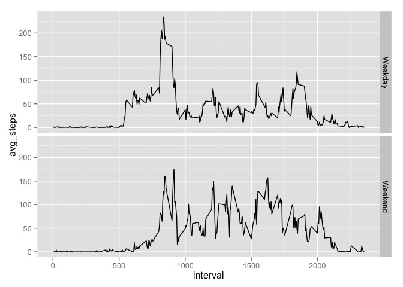

# Reproducible Research: Peer Assessment 1

## Loading and preprocessing the data
I started by unzipping the data and reading the csv file:

```r
d <- read.csv('activity.csv')
```

Checking the summary and the 'head' of the data, everything seems fine:

```r
summary(d)
```

```
##      steps                date          interval     
##  Min.   :  0.00   2012-10-01:  288   Min.   :   0.0  
##  1st Qu.:  0.00   2012-10-02:  288   1st Qu.: 588.8  
##  Median :  0.00   2012-10-03:  288   Median :1177.5  
##  Mean   : 37.38   2012-10-04:  288   Mean   :1177.5  
##  3rd Qu.: 12.00   2012-10-05:  288   3rd Qu.:1766.2  
##  Max.   :806.00   2012-10-06:  288   Max.   :2355.0  
##  NA's   :2304     (Other)   :15840
```

```r
head(d)
```

```
##   steps       date interval
## 1    NA 2012-10-01        0
## 2    NA 2012-10-01        5
## 3    NA 2012-10-01       10
## 4    NA 2012-10-01       15
## 5    NA 2012-10-01       20
## 6    NA 2012-10-01       25
```

One could convert the date variable (which is numeric) to a Date variable, but it does not really matter.

## What is mean total number of steps taken per day?
I start by summarizing the data frame by day with the ddply function.

```r
library(plyr)
d_day <- ddply(d, .(date), summarize, total_steps = sum(steps))
```

Then, I plot the histogram:

```r
hist(d_day$total_steps, main='Histogram of number of steps per day', xlab='steps per day')
```

 

Mean and median are (ignoring NA values):

```r
mean(d_day$total_steps, na.rm=T)
```

```
## [1] 10766.19
```

```r
median(d_day$total_steps, na.rm=T)
```

```
## [1] 10765
```


## What is the average daily activity pattern?
I again apply the ddply function for averaging over all days for each interval, and then plot the result.

```r
d_avgday <- ddply(d, .(interval), summarize, avg_steps = mean(steps, na.rm=T))
plot(d_avgday$interval, d_avgday$avg_steps, type='l', main='Average daily activity pattern', xlab='time of day', ylab='steps averaged over all days')
```

 

The maximum number of steps (on average over all days) occurs at: 835.

```r
d_avgday$interval[which.max(d_avgday$avg_steps)]
```

```
## [1] 835
```


## Imputing missing values
There are 2304 rows with missing values:

```r
colSums(is.na(d))
```

```
##    steps     date interval 
##     2304        0        0
```

I will follow the strategy of using the average number of steps over all days for intervals with missing values. I am using a good-old for loop, there must be more elegant ways of dealing with this (like apply for vectors), but it works...

```r
steps_filled <- numeric()
for(i in 1:nrow(d)) {
  s <- d[i,]$steps
  if(!is.na(s)) {
    steps_filled <- c(steps_filled, s)
  }
  else {
    steps_filled <- c(steps_filled, subset(d_avgday, interval==d[i,]$interval)$avg_steps)
  }
}

d_filled <- d
d_filled$steps <- steps_filled
```

I redo the ddply calculation like before, but now for the dataset with filled-in values.

```r
d_day_filled <- ddply(d_filled, .(date), summarize, total_steps = sum(steps))
```

I again plot the histogram:

```r
hist(d_day_filled$total_steps, main='Histogram of number of steps per day (imputed NA values)', xlab='steps per day')
```

 

Mean and median are:

```r
mean(d_day_filled$total_steps, na.rm=T)
```

```
## [1] 10766.19
```

```r
median(d_day_filled$total_steps, na.rm=T)
```

```
## [1] 10766.19
```

The differences in median and mean values are very small.

## Are there differences in activity patterns between weekdays and weekends?
The plot indicates some differences in activity patterns between weekdays and weekends.Weekdays show a marked peak in activity between 8 and 9 AM, and less activity throughout the day. Weekends also show a morning peak, but it is less marked and builds up later (almost no activity until 8 AM) and more activity is visible throughout the day.


```r
library(ggplot2)
d$weekday <- revalue(weekdays(as.Date(d$date, "%Y-%m-%d")), c('Saturday' = 'Weekend', 'Sunday' = 'Weekend', 'Monday' = 'Weekday', 'Tuesday' = 'Weekday', 'Wednesday' = 'Weekday', 'Thursday' = 'Weekday', 'Friday' = 'Weekday'))
d_avgday_2 <- ddply(d, .(interval, weekday), summarize, avg_steps = mean(steps, na.rm=T))
qplot(interval, avg_steps, data=d_avgday_2, geom="line", facets=weekday~.)
```

 

